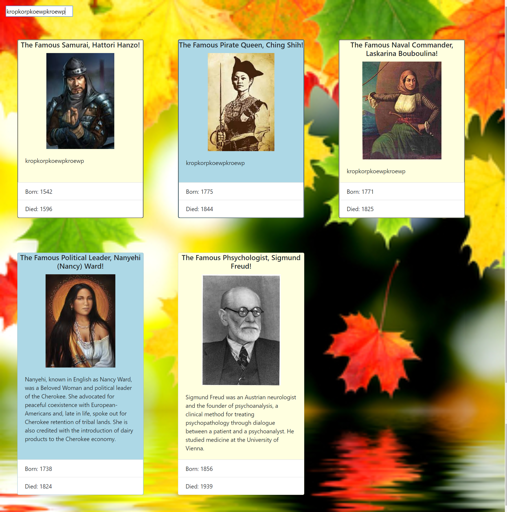

# What-You-See-Is-What-You-Get

This project was challenging. I practiced creating event listeners that did a number of things:
<ul>
 <li>change the css properties of a card when clicked</li>
 <li>focus on the input field</li> 
 <li>change the text on the card as I was typing in the input field</li> 
 <li>clear out the input field with the enter key</li>
</ul> 
I also practiced using boostrap and css to style the page.

## How to run this project
* Use npm to install http-server in your terminal:
```sh
npm install -g http-server
```
* Run the server
```sh
hs -p 9999
```
* Open chrome and navigate to:
```
localhost:9999
```

## Screenshots

### Homepage
